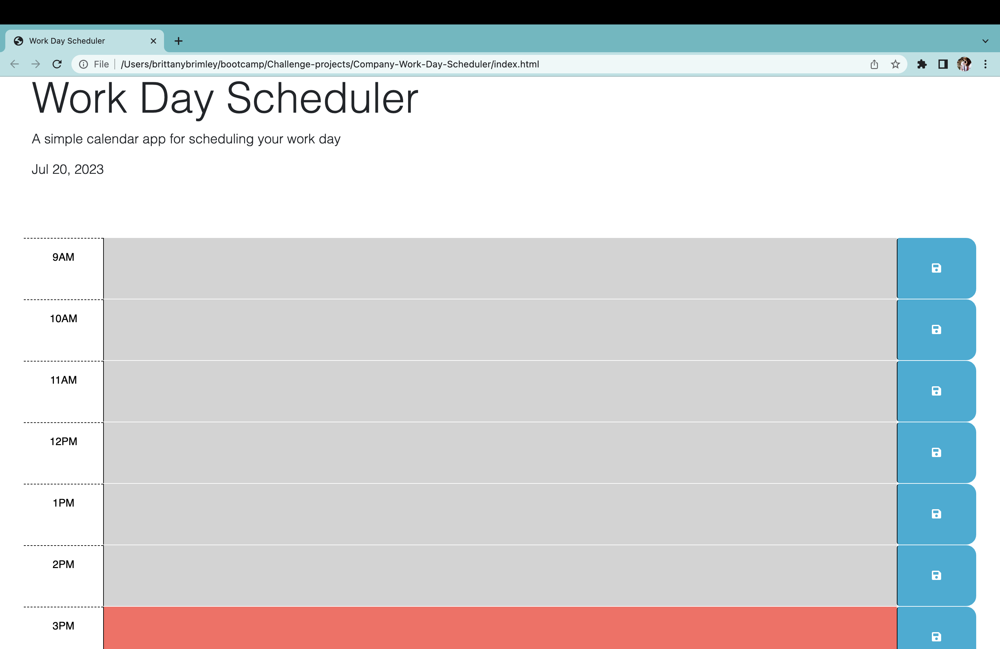

# Company-Work-Day-Scheduler

## Links
[GitHub Repo](https://github.com/Git-BritHub/Company-Work-Day-Scheduler.git)
 
[Live URL](https://git-brithub.github.io/Company-Work-Day-Scheduler/)

## Description
For an employee working a 9 to 5, I fixed and created a fully functioning Workday Scheduler. To assist employees in managing their time most effectively when they input events/meetings in this scheduler, I have added color-coded time blocks to help differentiate between past, present and future events. As time goes on in their work day, these color-coded blocks will change depending on what hour they are currently on with gray representing past, red representing current, and green representing future scheduled events.

## Usage

## Credits
Sought guidance and feedback from the U of U's software developer tutors.